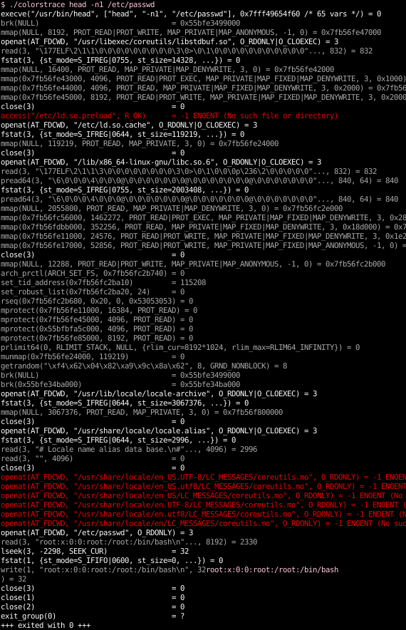

`colorstrace` - add color to `strace` output
============================================

[](https://github.com/kernc/colorstrace/actions)
[](https://github.com/kernc/colorstrace)
[](https://ghloc.vercel.app/kernc/colorstrace)
[](https://github.com/kernc/colorstrace)

A simple shell/AWK script that adds color to
[`strace`](https://strace.io/) output.

Fixes: https://github.com/strace/strace/issues/39

Installation
------------
Download somewhere onto your `$PATH` and make executable:
```sh
curl -vL 'https://bit.ly/colorstrace' | sudo tee /usr/local/bin/colorstrace
sudo chmod +x /usr/local/bin/colorstrace
```

Usage
-----
```sh
# Colorize existing trace
colorstrace < strace.log

# Trace program, colorizing output
colorstrace STRACE_ARGS PROG ARGS
```

Colors
------
`colorstrace` is line-oriented. The provided color coding is:
* ⬜ white – Highlighted syscalls.
  Use `$COLORSTRACE` environment variable to customize the
  list of syscalls you are interested in.
* ⬛ grey – Normal/boring/verbose syscalls.
* 🟥 red – Syscalls that failed / errored.
* 🟦 cyan – Logging messages from `strace`.

Remaining stdout / stderr are left as-is.
Feedback most welcome!

Example
-------

